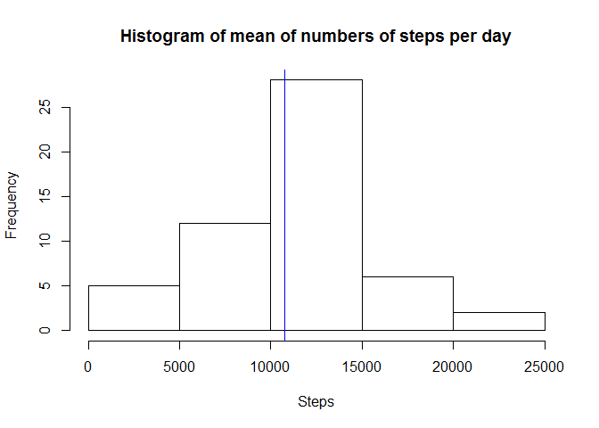

# Reproducible Research: Peer Assesment 1
Daniel Rosquete  
April 2, 2016  
## Summary

### The question

This project contains many questions, each will be responded in an individual
section.

### The dataset

This dataset is provided by the evaluators, consists in a csv which contains a
large amount of data about personal movement using activity monitoring devices.
This assignment makes use of data from a personal activity monitoring device. This device collects data at 5 minute intervals through out the day. The data consists of two months of data from an anonymous individual collected during the months of October and November, 2012 and include the number of steps taken in 5 minute intervals each day. The dataset is stored in a comma-separated-value (CSV) file and there are a total of 17,568 observations in this dataset.

It is obtained in this link: https://d396qusza40orc.cloudfront.net/repdata%2Fdata%2Factivity.zip

And the variables associated are:

**steps**: Number of steps taking in a 5-minute interval (missing values are coded as NA)

**date**: The date on which the measurement was taken in YYYY-MM-DD format

**interval**: Identifier for the 5-minute interval in which measurement was taken

## Cleaning the dataset


```r
originalData <- read.csv(file = "activity.csv")

#Backuping the original data for modifications
projectData <- originalData

#Cleaning the NA
projectData[is.na(projectData$steps),]$steps <- mean(na.omit(projectData$steps))
```


## First Question
### What is mean total number of steps taken per day?

```r
stepsTotal <- aggregate(steps ~ date,data=originalData,sum)
meanTotalSteps <- mean(stepsTotal$steps)
medianTotalSteps <- median(stepsTotal$steps)
sumTotalSteps <- sum(stepsTotal$steps)
meanTotalSteps
```

```
## [1] 10766.19
```

```r
medianTotalSteps
```

```
## [1] 10765
```

**The mean is: 10766 and the median is: 10765**

Now that we have the stepsTotal dataframe, let´s plot the histogram with the blue line indicating the mean.


```r
hist(stepsTotal$steps,xlab="Steps",main="Histogram of mean of numbers of steps per day")
abline(v=meanTotalSteps,col="blue")
```



## Second Question
### What is the average daily activity pattern?


```r
avgStepsPI <- aggregate(steps ~ interval, data=projectData, mean)

plot(avgStepsPI$interval, avgStepsPI$steps, type='l', col=1,
     main="Average steps by Interval", xlab="Time Intervals",
     ylab="Average steps")

abline(h=mean(avgStepsPI$steps), col="blue", lwd=2)
```


The previous plot is by 5-minutes interval

This plot shows a time series plot of the 5-minute interval (x-axis) and the average number of steps taken, averaged across all days (y-axis).

Now the question is, which 5-minute interval, on average across all the days in the dataset, contains the maximum number of steps?

```r
maxInter <- which.max(avgStepsPI$steps)
avgStepsPI[maxInter,]$interval
```

```
## [1] 835
```
**Answer:** The maximum interval is the 835

## Third Question
### Imputing missing values

Note that there are a number of days/intervals where there are missing values (coded as NA). The presence of missing days may introduce bias into some calculations or summaries of the data.

First is necessary to calculate the total number of rows with NA´s

```r
cat("Number of missing values =",sum(is.na(originalData$steps)))
```

```
## Number of missing values = 2304
```
Second, in a new dataframe, Devise a strategy for filling in all of the missing values in the dataset. In this case I will use the mean, which is almost the same as the median.

```r
filledData <- originalData
meanFilledData <- mean(na.omit(filledData$steps))
filledData$steps[is.na(filledData$steps)] <- meanFilledData
cat("Number of missing values =",sum(is.na(filledData$steps)))
```

```
## Number of missing values = 0
```

```r
avgStepsFilled <- aggregate(steps ~ date, data=filledData, sum)
```
Now that we have the filledData dataframe, let´s plot the histogram.

```r
hist(avgStepsFilled$steps,xlab="Steps",main="Histogram with NA´s replacement strategy")
```


**Report the mean and the median**

**Do these values differ from the estimates from the first part of the assignment? **

Actually, they do but the impact is ONLY in the frequency, and it is logical, however, the proportions remains the same.

**What is the impact of imputing missing data on the estimates of the total daily number of steps?**


```r
meanAvgStepsFilledSteps <- mean(avgStepsFilled$steps)
medianAvgStepsFilledSteps <- median(avgStepsFilled$steps)
sumAvgStepsFilledSteps <- sum(avgStepsFilled$steps)
meanAvgStepsFilledSteps
```

```
## [1] 10766.19
```

```r
medianAvgStepsFilledSteps
```

```
## [1] 10766.19
```

**The mean is: 10766 and the median is: 10766**

The changes are minimum about the original data.

## Fourth Question
### Are there differences in activity patterns between weekdays and weekends?

```r
library(chron)
library(ggplot2)
weekendData <- projectData[is.weekend(projectData$date),]
weekData <- projectData[!is.weekend(projectData$date),]
```

```r
weekendStepsPI <- aggregate(steps ~ interval, data=weekendData, mean)
weekStepsPI <- aggregate(steps ~ interval, data=weekData, mean)
weekendStepsPI$type<-"weekend"
weekStepsPI$type<-"weekdays"
weekDays<-merge(weekendStepsPI,weekStepsPI,all = TRUE)
```

```r
qplot(interval,steps,data=weekDays,facets=type~., 
      main="Weekend Average steps by Interval",xlab = "Interval",ylab="Steps",
      geom="line",colour=type)
```


They look alike, however in weekdays there are more steps in peaks.
